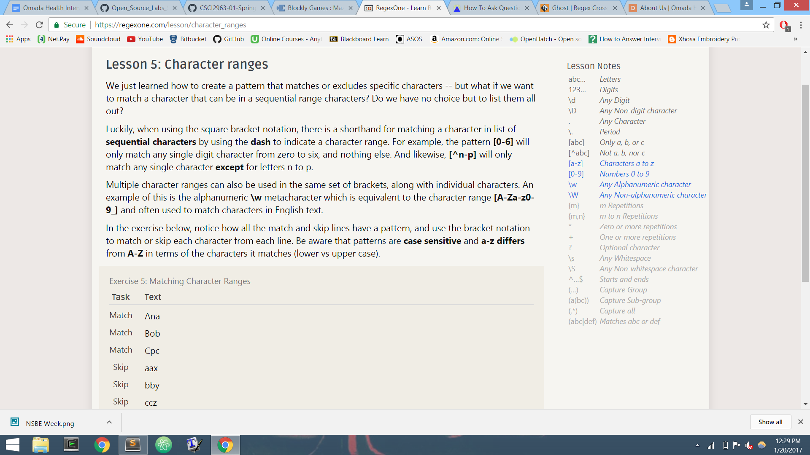

## Name: Aaron Taylor (tayloa) - 
### More ways to ask a question:

### Free Culture Chapter 3 Reflection:
This event shows how open source can clash with certain business models.I don't think Jesse should take responsibility for how his software was used. If the company does not have the power to control the distribution of it's music, that is their problem. Open source software is designed to be non-restrictive. Preventing music from being stored in the search engine would go against that rule. This event also shows how careful you must be when you release your software. The lack of restriction gives the chance for your software to be used with ill intent.

### Console after installing Tree and gettting the directory structure : 

### Completion of Regex Exercises:
Regex One: Stopped after 7 problems

