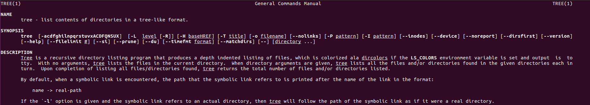
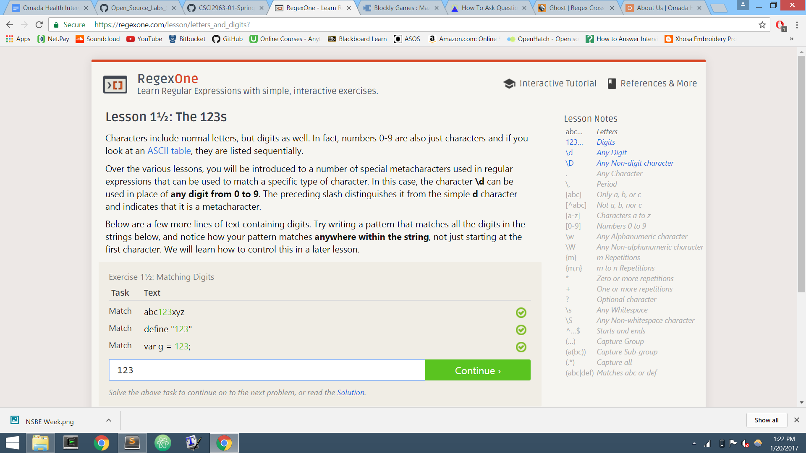
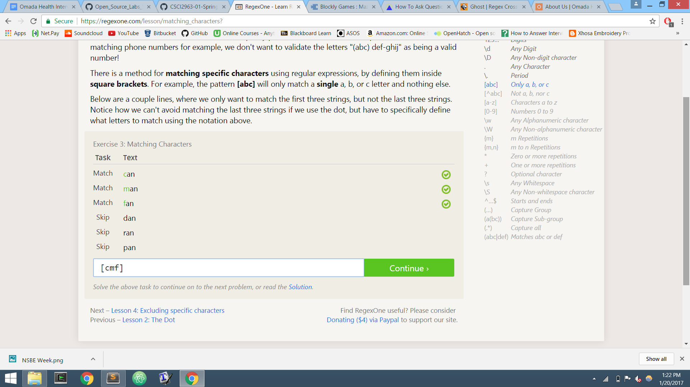
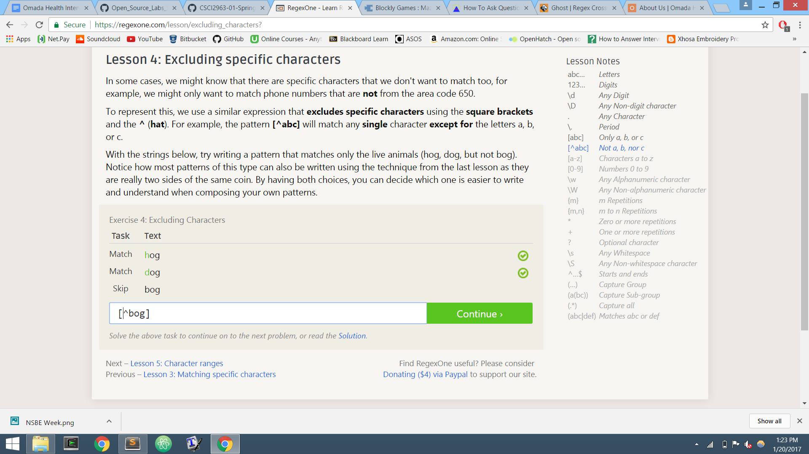
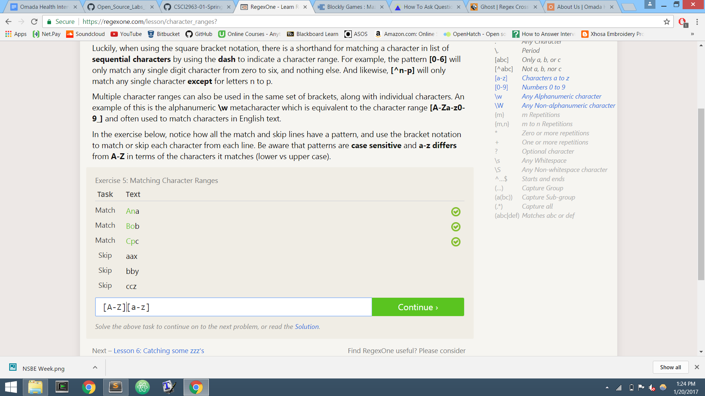
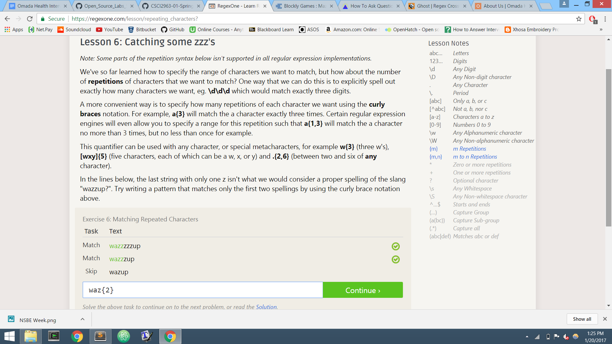

## Name: Aaron Taylor (tayloa) - 
### More ways to ask a question:
-Understand what you have down up to the point you are currently stuck at. This way the person your are saking will understand the problem.
-read over your code slowly before imediately asking a question. It may be a minor issue.

### Free Culture Chapter 3 Reflection:
This event shows how open source can clash with certain business models.I don't think Jesse should take responsibility for how his software was used. If the company does not have the power to control the distribution of it's music, that is their problem. Open source software is designed to be non-restrictive. Preventing music from being stored in the search engine would go against that rule. This event also shows how careful you must be when you release your software. The lack of restriction gives the chance for your software to be used with ill intent.

### Console after installing Tree and gettting the directory structure : 

### Completion of Regex Exercises:
Regex One: Stopped after 7 problems

Regex Crossword Puzzles:

### A Problem that Interests Me
One problem I recently encountereded was quickly adding following people on social media. I see friends find it annoying to open every app they have to try to find another friend's page. If there were a way to somehow scan a code and automatically follow the person on the accounts connected to that code, it would solve this problem.
