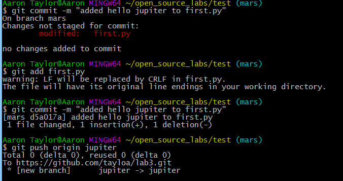

# Part 1
#### New repository made with git bash
https://github.com/tayloa/lab3

#### Making README.md and first.py

#### Adding mars and jupiter branches

#### Branch visualization with gitk, gitk --all, and git log

# Part 2
