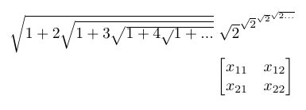
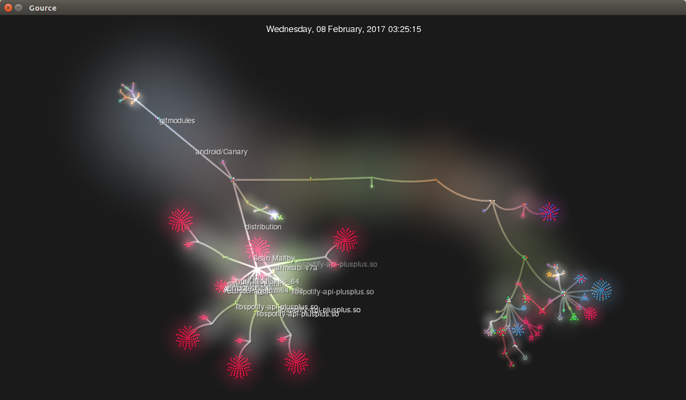
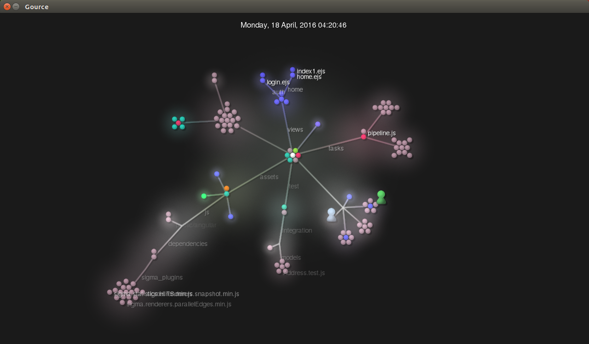
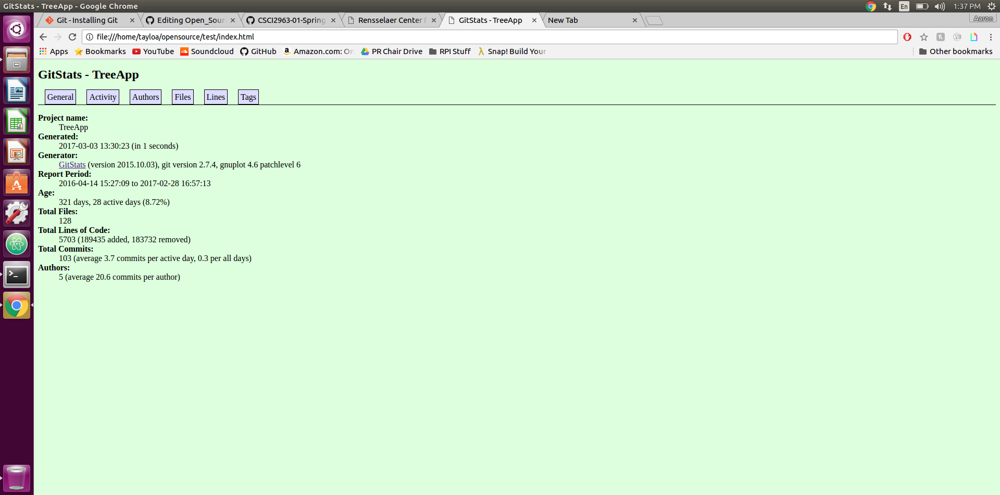
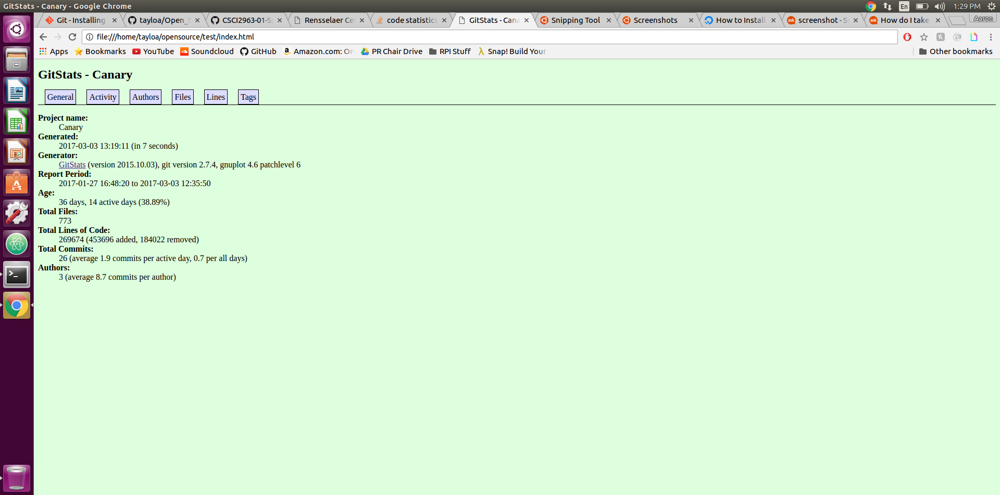

# Part 0
$\sqrt{1+2\sqrt{1+3\sqrt{1+4\sqrt{}1+...}}}$  
$\sqrt{2}^{\sqrt{2}^{\sqrt{2}^{\sqrt{2...}}}}$  
  
# Part 1
- Cloned the Canary app  
 - Number of contributers: 2 
 - Number of lines: 24603 
 - the first commit: Jan 27, 2017  
 - the latest commit: Mar 3, 2017  
 - the current branches: master 
- Cloned the family tree app  
 - Number of contributers: 3 
 - Number of lines: 5703 
 - the first commit: Apr 14, 2016  
 - the latest commit: February 28, 2017  
 - the current branches: svg-to-canvas, akamar/d3Start, akamar/Base64Pictures, akamar/refractor-angular-architecture,    akmar/gulpify, ak/flowtype 
 
 ## Streaming Contribution Visualizations
 - Canary  
  - Leader: Sean Maltby  
  - Visualization:  
  -   
 - Family Tree App  
  - Leader: Aesa Kamar  
  - Visualization:  
  -   
 
-Gitstats resutls:  
  

# Part 2
