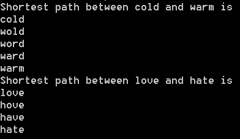
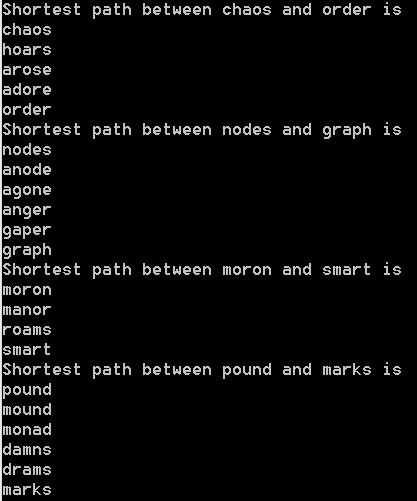
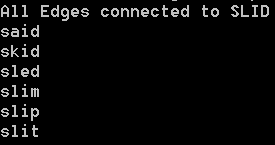
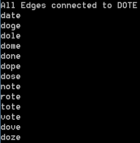
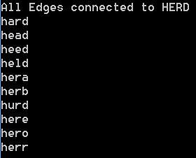
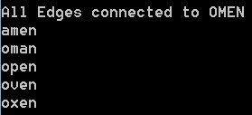
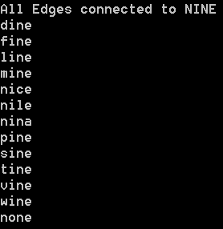
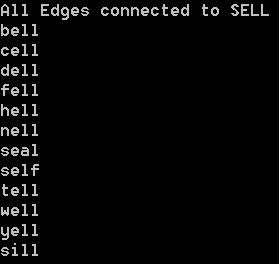
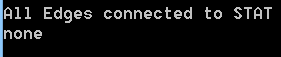
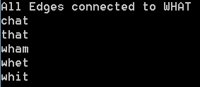

- Regular Word Ladder Implementation    
    - Word ladder with the following words (5 letters)
    1.   `chaos` to `order`
    2.   `nodes` to `graph`
    3.   `pound` to `marks` 

    4.   `moron` to `smart`  
  

- Word ladder with the following words (4 letters)
    1.   `cold` to `warm`
    2.   `love` to `hate` 

- New Word Ladder Implememntation: Words are adjacent if 1 letter is different, order doesn't matter
    - Word ladder with the following words (5 letters)
    1.   `chaos` to `order`
    2.   `nodes` to `graph`
    3.   `moron` to `smart`
    4.   `pound` to `marks`  
  
- Words that precede: SLID, DOTE, HERD and OMEN 
    - SLID:  

    - DOTE:  

    - HERD:  

    - OMEN:  

- Words that follow: NINE, SELL, STAT and WHAT
    - NINE:  

    - SELL:  

    - STAT:  

    - WHAT:  

