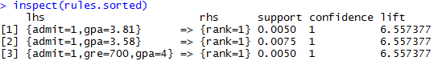
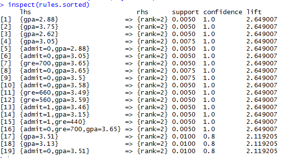
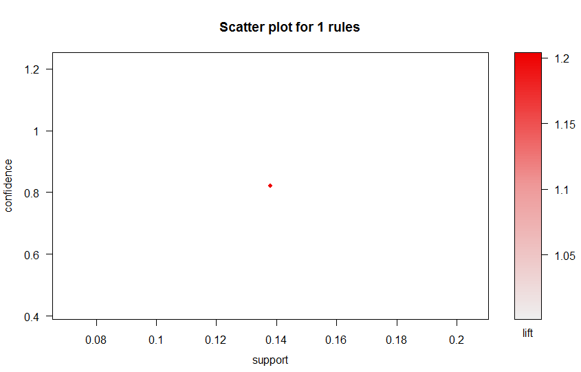
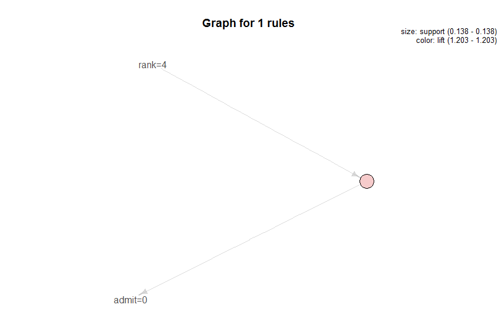

# Lab 7
## 3. Association Data Set
### Admissions Data  

### Admissions Rules   

### Data Sorted by Rank   
#### Rank 1

#### Rank 2

### Visualizations for Admissions Rules
#### Scatter Plot   

#### Graph with Nodes  

