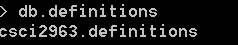
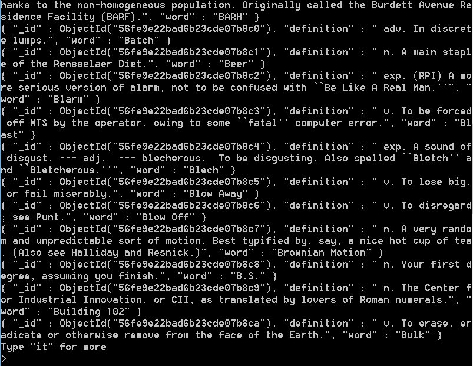
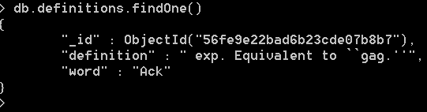
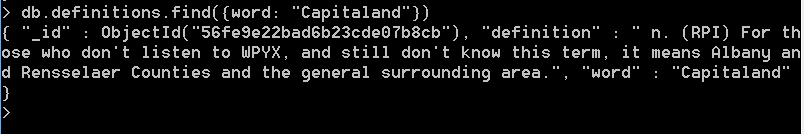
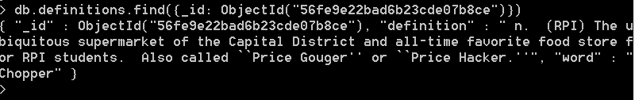
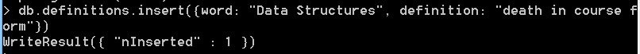
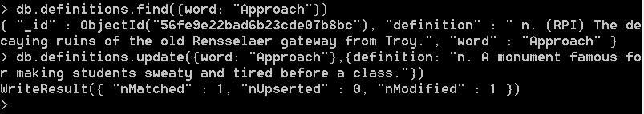

# MongoDB Lab for CSCI2963
### 3/31/2017

## Checkpoint 3
### Command Results
#### db.definitions

#### db.definitions.find(): Looks for an item in the database based on a query

#### db.definitions.findOne(): Finds one random item in the database

##### db.definitions.find({word: "Capitaland"})

##### db.definitions.find({_id: ObjectId("56fe9e22bad6b23cde07b8ce")}) 

### Making Changes
#### Adding "Data Structures" Definition

#### Changing "Approach" Definition

